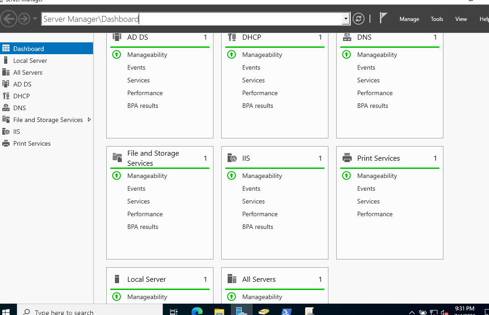
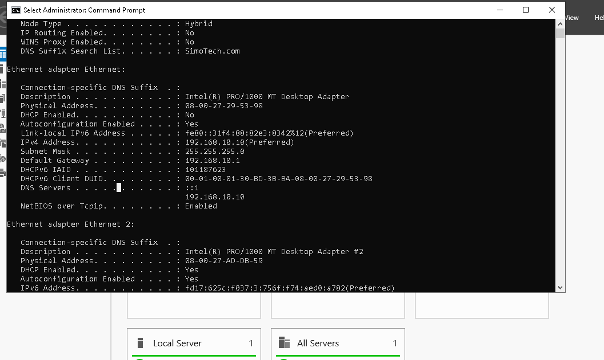
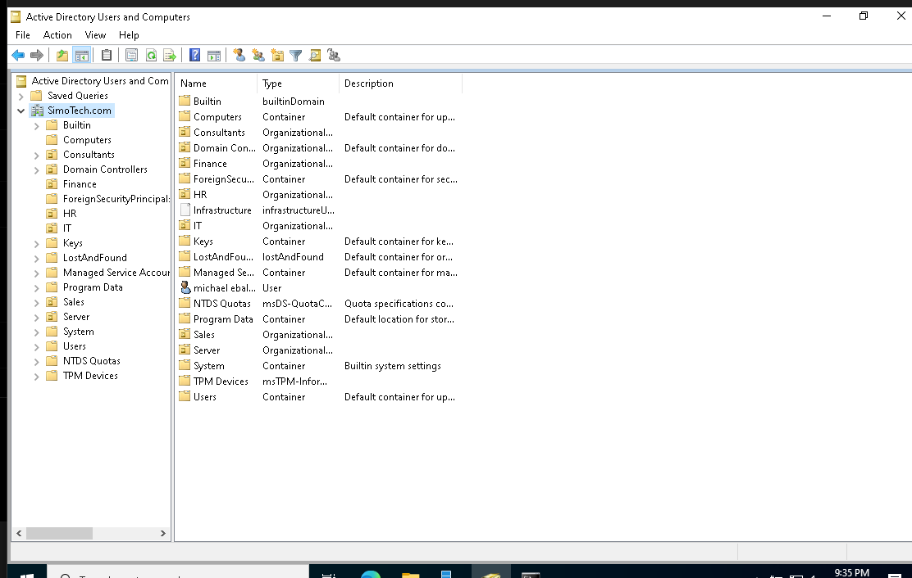
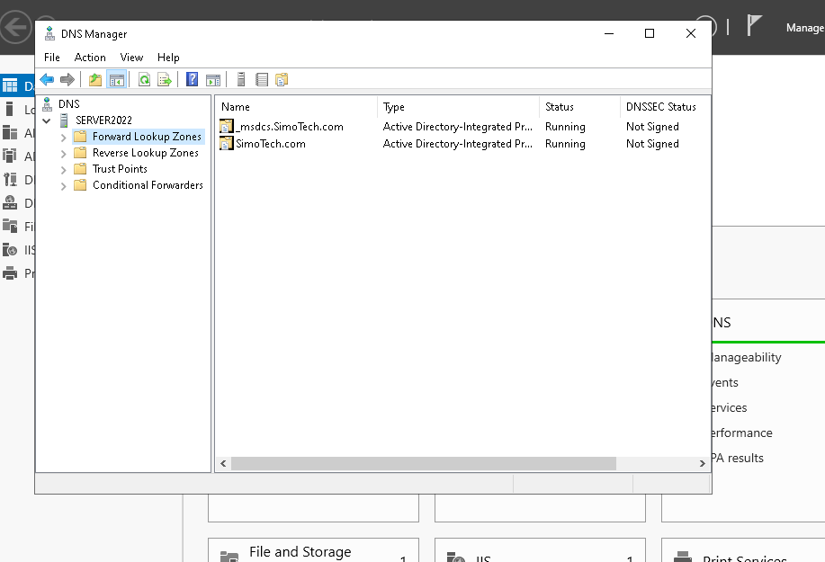
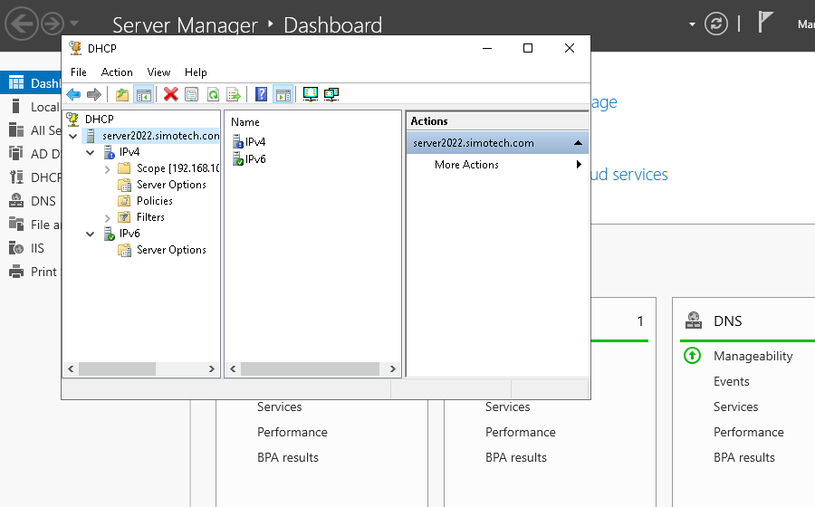
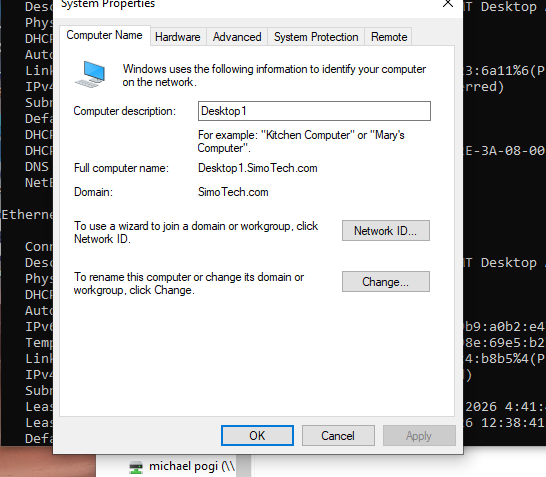
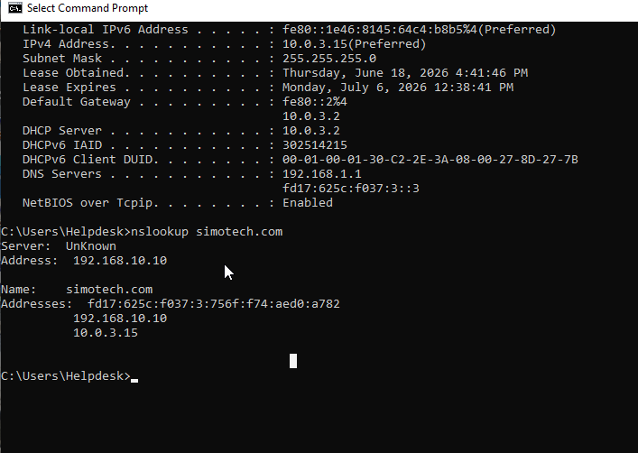
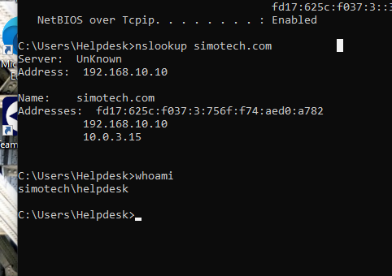

# Testing Results

This document contains the verification tests performed in the Active Directory Home Lab.

## Server Role Verification

| Test | Expected Result | Actual Result |
|------|-----------------|---------------|
| AD DS role installed | AD DS visible in Server Manager | Success |
| DNS role installed | DNS visible in Server Manager | Success |
| DHCP role installed | DHCP visible in Server Manager | Success |

---

## Server IP Configuration

The Windows Server 2022 domain controller was configured with a static IP address.

| Item | Result |
|------|--------|
| IPv4 Address | 192.168.10.10 |
| DNS Server | 192.168.10.10 |
| Domain Suffix | SimoTech.com |

---

## Active Directory Verification

Active Directory Users and Computers shows the SimoTech.com domain, organizational units, and domain users.

---

## DNS Verification

DNS Manager shows the SimoTech.com forward lookup zone.

---

## DHCP Verification

DHCP Manager shows the configured IPv4 scope for the lab network.

---

## Windows 10 Domain Join Verification

The Windows 10 client successfully joined the SimoTech.com domain.

---

## Client DNS Test

The Windows 10 client successfully resolved the SimoTech.com domain using the domain controller DNS server.

---

## Domain User Login Test

The Helpdesk domain user successfully logged in to the Windows 10 client.

---

## Final Result

The Active Directory lab successfully demonstrated domain services, DNS, DHCP, Windows 10 domain joining, and domain user login verification.
